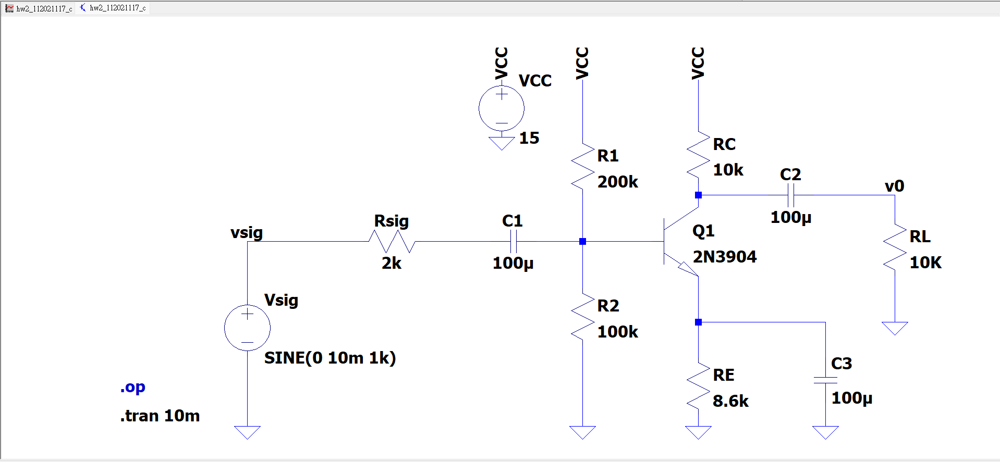
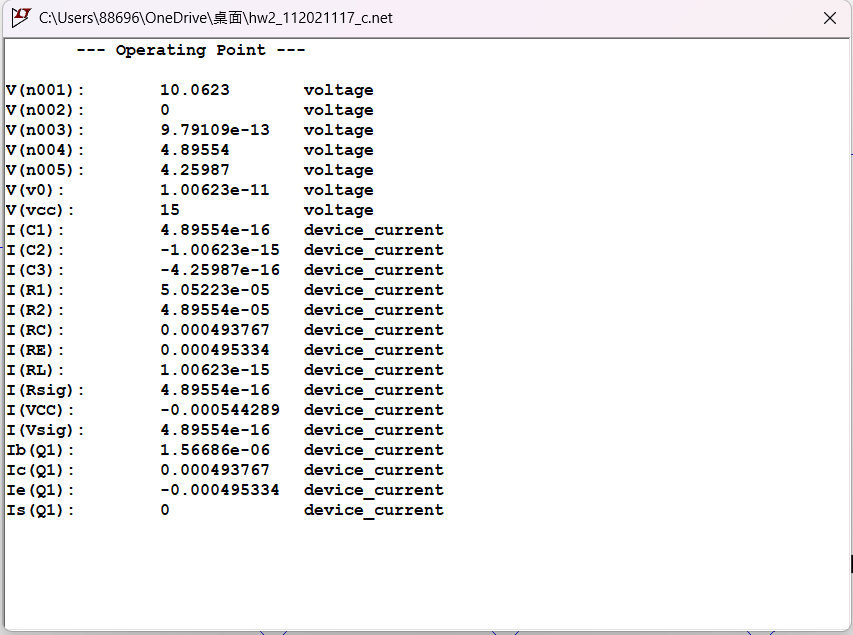
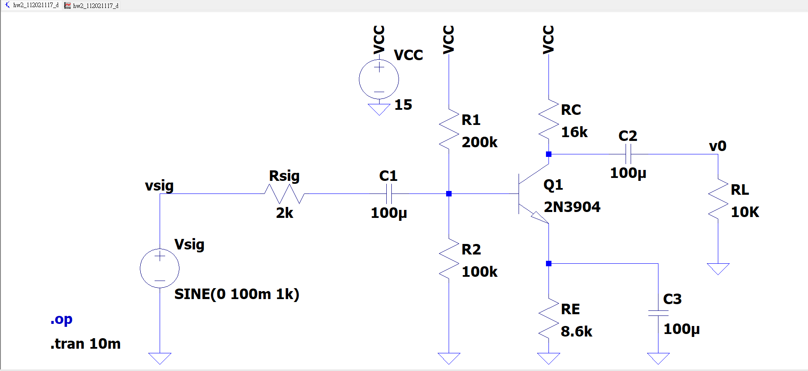
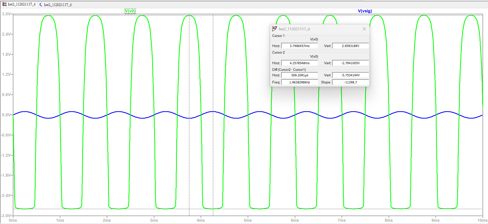
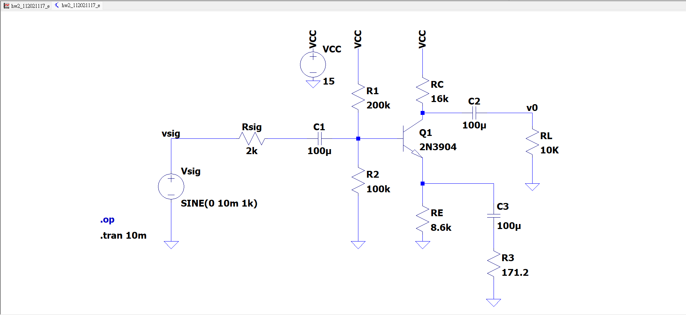
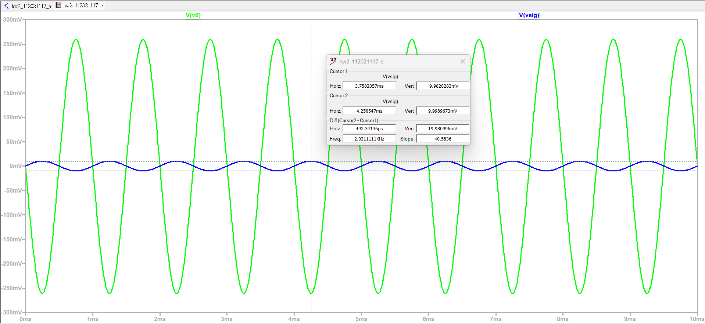
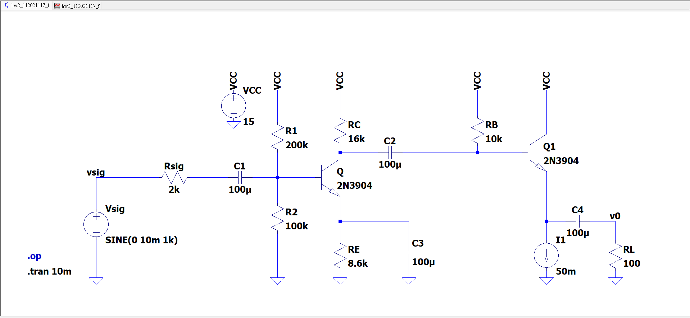
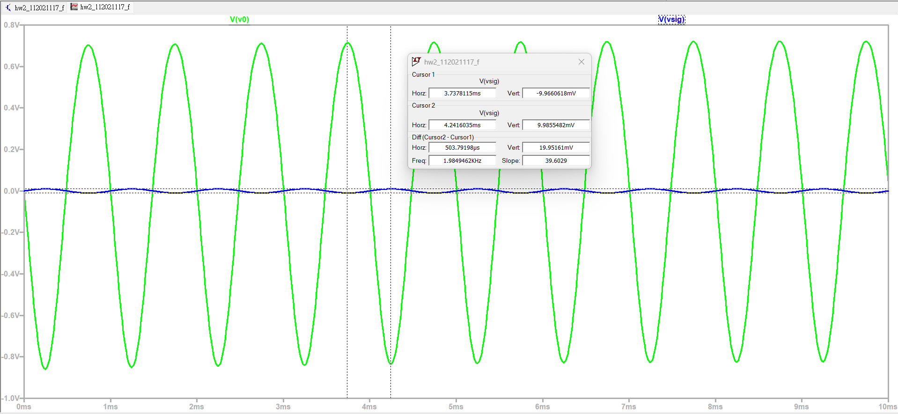

# BJT Amplifier Design and Emitter Follower Integration

本專案為電子學作業與專案實作，旨在設計與實現一個高效能的 **共射極 (Common-Emitter, CE) 放大器**，並深入探討工作點設定、大訊號削波調整、射極退化增益控制，以及透過 **射極隨耦器 (Emitter Follower)** 級聯架構來隔離 100 Ω 重負載的完整電路設計與 LTspice 模擬驗證。

---

## 📋 系統設計規格 (Design Specifications)
* **電源供應 (VCC)**: 15 V
* **訊號源阻抗 (Rsig)**: 2 kΩ
* **負載電阻 (RL)**: 10 kΩ（後續擴展至重負載 100 Ω）
* **電晶體型號**: 2N3904 (NPN)
* **設計目標**: 
  * 電壓增益大小 |vo / vsig| ≥ 50
  * 輸出訊號擺幅 -3 V ≤ vo ≤ 3 V
  * 總消耗功率 < 150 mW

---

## 1. 共射極放大器設計與偏壓計算 (Common-Emitter Design)
* **工作點選擇**: 評估 0.5 mA 與 10 mA 兩個操作點後，選定偏壓電流 IC = 0.5 mA。此點可提供更大的增益邊際（|Av| ≈ 88.36），且總功耗僅約 8.16 mW，完全符合低功耗要求。
* **電阻參數計算**: 
  * 集極電阻 RC = 10 kΩ
  * 射極電阻 RE = 8.6 kΩ
  * 分壓電阻 R1 = 200 kΩ, R2 = 100 kΩ

### 🔬 基礎電路圖與模擬結果
| LTspice 電路圖 | DC 工作點分析 |
| :---: | :---: |
|  *CE 放大器原始電路圖* |  *DC 工作點分析（功耗 8.16mW）* |

---

## 2. 大信號響應與 RC 微調 (Large-Signal Analysis)
* **問題發現**: 當輸入振幅增至 100 mV 時，原設計因集極電壓擺幅受限，導致輸出端產生非線性削波（Asymmetric Clipping）。
* **解決方案**: 保持偏壓電流 IC 不變，將集極電阻微調提升至 **RC = 16 kΩ**，重新定位靜態工作點以獲得對稱的輸出擺幅。

| 微調後電路圖 | 大信號輸出波形 (5.753 Vpp) |
| :---: | :---: |
|  *圖 6：微調後 RC = 16 kΩ 電路圖* |  *圖 8：無失真輸出波形* |

---

## 3. 射極退化增益調整 (Emitter Degeneration)
* **目的**：透過在射極串接電阻 R3，精確調控並降低整體增益至目標比例（縮減為約 1 / 3）。
* **參數校正**：考量 Early 效應與動態變異，經實驗校正後選定 **R3 = 171.2 Ω**。
* **驗證結果**：成功將輸出峰峰值調整至 529.4 mVpp（增益 ≈ 26.5），完美達成預期增益縮減目標。

  
  

<em>加入 R3 = 171.2 Ω 後的電路圖與穩定輸出波形。</em>

---

## 4. 射極隨耦器串接與低阻抗負載隔離 (Emitter Follower Integration)
* **挑戰**: 當負載驟降至重負載 RL = 100 Ω 時，直接連接會使電壓增益驟降至 ≈ 2。
* **解決方案**: 串接一級 **射極隨耦器 (Emitter Follower)** 作為阻抗緩衝級。
* **關鍵參數設計**:
  * 偏壓電流 I1 = 50 mA（確保負載大訊號下拉時維持 iE1 > 0）
  * 基極偏壓電阻 RB = 10 kΩ（兼顧 AC 增益下限與 DC 工作點飽和上限）
* **最終成效**: 總電壓增益達到 **77.59**，成功在 100 Ω 重負載下維持 |vo / vsig| ≥ 50 的設計要求且無失真。

| 級聯系統電路圖 | 重負載 (100 Ω) 輸出波形 (1.548 Vpp) |
| :---: | :---: |
|  *CE 串接 Emitter Follower 完整電路圖* |  *100 Ω 負載下的乾淨輸出波形* |

---

## 🚀 快速開始 (Quick Start)
1. 使用 **LTspice** 開啟對應的 `.net` 或 `.asc` 模擬檔案。
2. 執行 `.op` (DC Operating Point) 檢查各節點電壓與功率消耗。
3. 執行 `.tran 10m` (Transient Analysis) 檢視 1 kHz 輸入下的動態波形與增益表現。